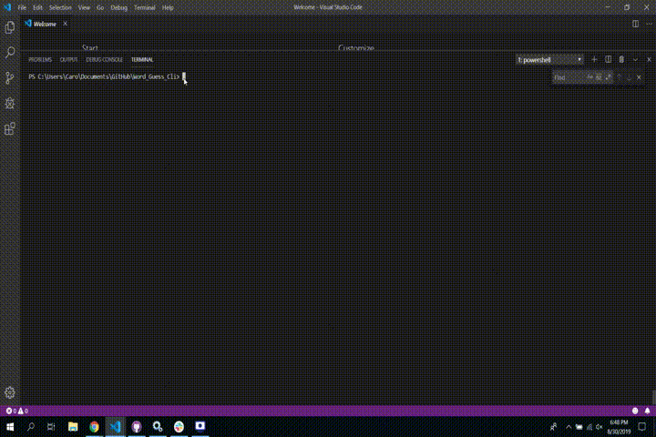

# Word_Guess_Cli

Author: Carolina(Caro) Berry

### Project Overview

## Let's Play Word Guess of America States

In the command bash type 'node index' and the user will be prompt to confirm if would like to play. Press "Y or y" for Yes or "N or n" for No. If No is select the program will end. If Yes is selected then the first State will be randomly choosen and user will be prompt to "Guess a letter". If the letter is part of the word, the hidden answer will be updated and user will again be prompt to "Guess a letter". If the letter is not part of the hidden answer, then user will lost a turn (12 turns in total) and will prompt again for another letter. If the letter is repeated then user will get a message informating that letter has been guessed. When the user complete the State name the answer will show and another State will prompt to be guessed.